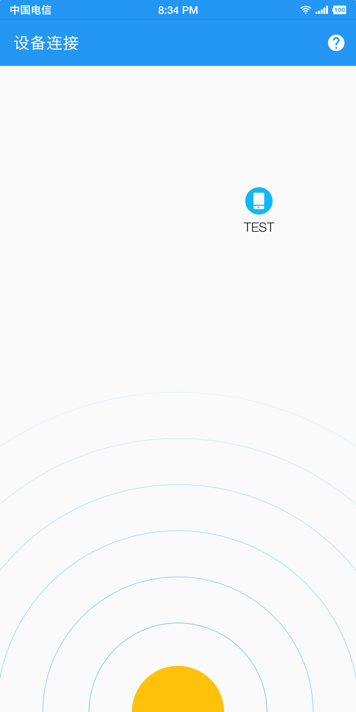
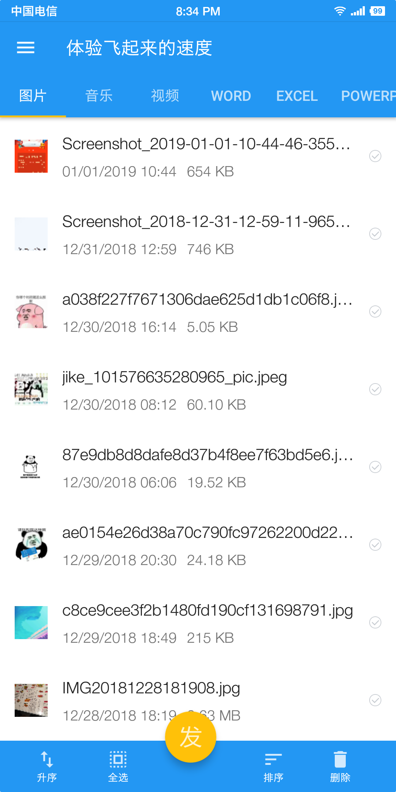

# FastAir
* [简体中文](https://github.com/hongui/FastAir/blob/master/README_zh-CN%2Cmd)

A Android APP design to transferring files and IM between two Android device.Using WIFIP2P and Socket API.

# What technology was used?
1. Custom View
2. Custom CoordinatorLayout layout behavior
3. Simple Socket abstract and encapsulated
4. Kotlin Coroutines
5. Kotlin use case
6. Jetpack use case
7. Other interesting

# APK
[Just want a APK.](https://github.com/hongui/FastAir/releases)

# Preview
## Discover Device

## Home List

## Chat List

## Transmission List

