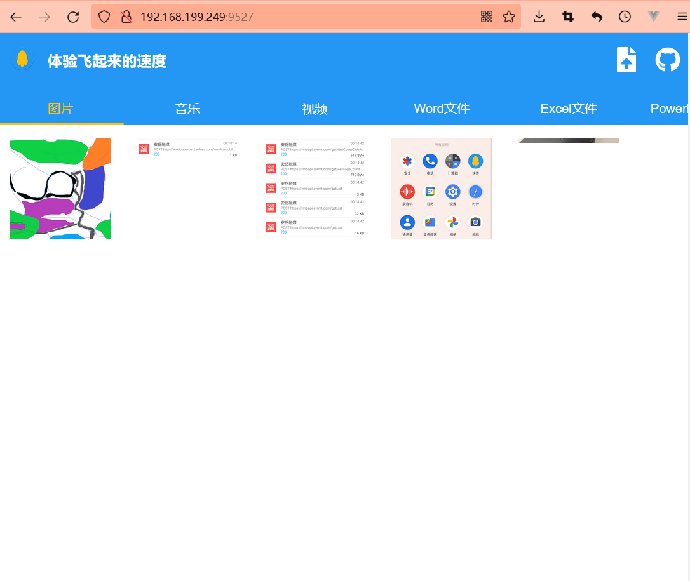

# 快传
快传是一个借助WIFIP2P和Socket API，在两台Android设备间传递文件或者聊天的应用。

# 新特性
- 本地主机——实现了一个简陋版的Http本地服务器，主要用来传输手机和PC间的文件；
- Svelte前端——一个简单的Svelte项目，用来展示手机上的文件并可以下载PC上的文件。

# 使用的技术
1. 自定义View[LoadingView](app/src/main/java/com/mob/lee/fastair/view/LoadView.kt)
2. 自定义CoordinatorLayout布局的behavior[TranslationBehavior](app/src/main/java/com/mob/lee/fastair/view/TranslationBehavior.kt)
3. Socket的抽象和封装[SocketService](app/src/main/java/com/mob/lee/fastair/io/SocketService.kt)
4. Kotlin协程的使用
5. Kotlin代码示例
6. Jetpack代码示例
7. 其他有意思的东西
8. Http实现
9. Svelte

# APK
[只需要个APK的安装包.](https://github.com/hongui/FastAir/releases)

# 页面预览
## PC端

## 手机端

